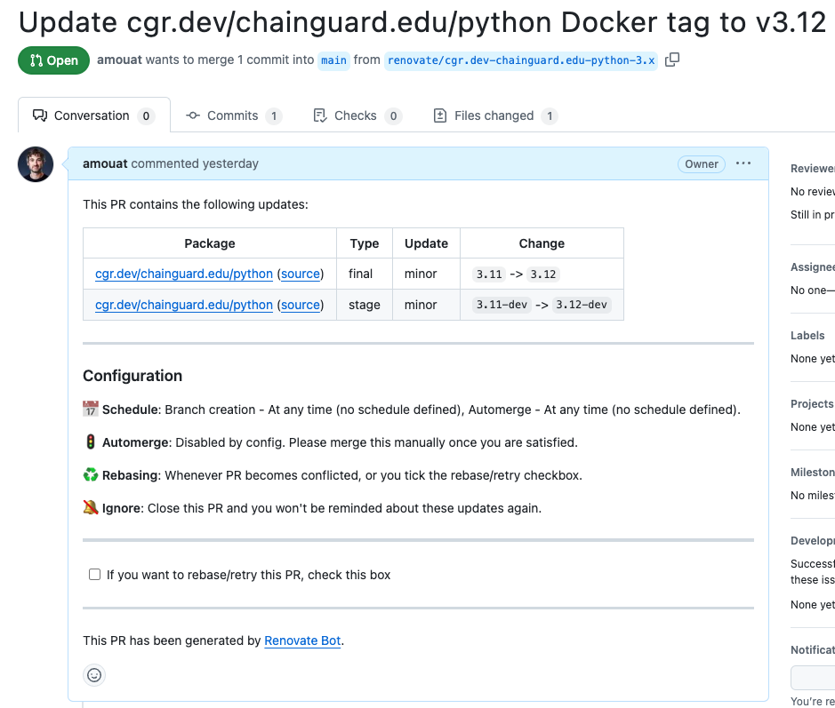
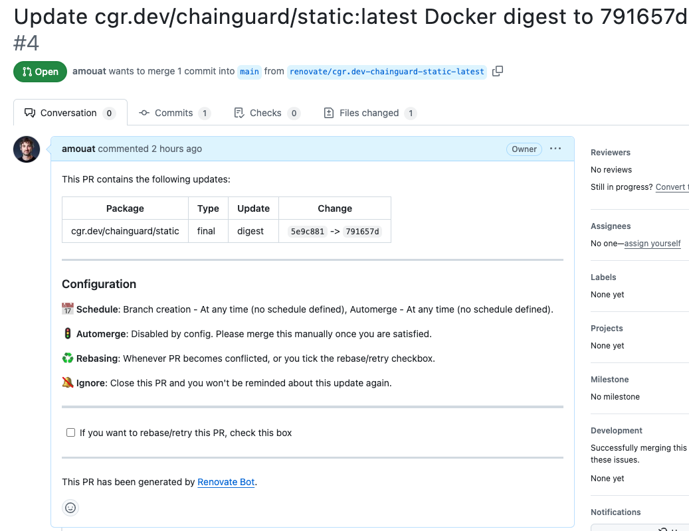

Renovate can be used to alert on updates to Chainguard Images. This can be an effective way to keep your images up-to-date and CVE free. This article will explain how to configure Renovate to support Chainguard Images.

This following assumes you have successfully installed and configured Renovate. If not, please refer to the installation instructions.

> *NOTE:* This article describes using Renovate to alert on new versions of *Images*. It is not about alerts for Wolfi packages (which is unsupported at the time of writing).

In order to support versioned images from a private repository you will need to provide Renovate with credentials to access the Chainguard registry at `cgr.dev`. This can be done by creating a token with `chainctl` e.g:

```shell
chainctl auth configure-docker --pull-token
```

This will respond with output such as:

```shell
To use this pull token in another environment, run this command:

    docker login "cgr.dev" --username "<USERNAME>" --password "<PASSWORD>"
```

By default, this credential is good for 30 days.

You can now configure `hostRules` in Renovate to support our registry.

Depending on how Renovate was set up, you can add this to `config.json` or `config.js` with a setting such as:

```
{
...
   "hostRules": [
    {
      "hostType": "docker",
      "matchHost": "cgr.dev",
      "username": "<USERNAME>",
      "password": "<PASSWORD>"
     }]
}
```

_DO NOT_ check this file into source control with the exposed secret. Instead, you can use environment variables which you pass in at runtime e.g:

```json
{
...
   "hostRules": [
    {
      "hostType": "docker",
      "matchHost": "cgr.dev",
      "username:" process.env.CGR_USERNAME,
      "password:" process.env.CGR_PASSWORD,
     }]
}
```

But an even better solution is to create a script which automatically updates the configuration with the correct values by calling `chainctl`. If you do this, you should also set the credential lifetime to a much shorter period with the `–ttl` flag e.g:

```shell
chainctl auth configure-docker --pull-token –ttl 10m
```

This will set the lifetime to 10 minutes, which limits the risk posed if the token should leak.

You can also set the lifetime to a longer period for more manual configurations.

## Updating Versioned Images

By default, Renovate should now open PRs for any out-of-date versions of images. For example, you can run Renovate with the following Dockerfile:

```
FROM cgr.dev/chainguard.edu/python:3.11-dev AS builder
...

FROM cgr.dev/chainguard.edu/python:3.11
...
```

At the time of writing, 3.12 was the current version of the Python image, so the following PR was opened by Renovate:



Not all images use semantic versioning. See the [Renovate documentation](https://docs.renovatebot.com/modules/manager/dockerfile/\#additional-information) for details on how to support different schemes.

Ideally image references should also be pinned to a digest, as shown in the following section.

## Updating :latest Images

Renovate also supports updating image references that are pinned to digests. This allows you to keep floating tags such as `:latest` in sync with the most up-to-date version. For example, for the following Dockerfile:

```
FROM cgr.dev/chainguard/go:latest-dev@sha256:ff187ecd4bb5b45b65d680550eed302545e69ec4ed45f276f385e1b4ff0c6231 as builder

WORKDIR /work

COPY go.mod /work/
COPY cmd /work/cmd
COPY internal /work/internal

RUN CGO_ENABLED=0 go build -o hello ./cmd/server

FROM cgr.dev/chainguard/static:latest@sha256:5e9c88174a28c259c349f308dd661a6ec61ed5f8c72ecfaefb46cceb811b55a1
COPY --from=builder /work/hello /hello

ENTRYPOINT ["/hello"]
```

Renovate opened two similar PRs, the following image shows the PR to update the static image:



## Troubleshooting

### Connection Errors

If you have problems getting Renovate to monitor cgr.dev, please double check the connection details. Make sure the token is still valid (you can verify with `chainctl iam identities list`) and it has access to the repository you are referring to. Test the credentials by doing a \`docker login\` and \`docker pull\` in a clean environment.

### getRelaseList error

You may see errors such as the following:

```
DEBUG: getReleaseList error (repository=chainguard-images/images-private, branch=renovate/cgr.dev-chainguard.edu-python-3.x)
       "type": "github",
       "apiBaseUrl": "https://api.github.com/",
       "err": {
         "message": "`chainguard-images` forbids access via a personal access token (classic). Please use a GitHub App, OAuth App, or a personal access token with fine-grained permissions.",
         "stack": "Error: `chainguard-images` forbids access via a personal access token (classic). Please use a GitHub App, OAuth App, or a personal access token with fine-grained permissions.\n    at
…
```

These can be safely ignored. They are caused by Renovate using the `org.opencontainers.image.source` label on our images to look for a changelog. As this source is set to the private images-private GitHub repository, this request fails.
